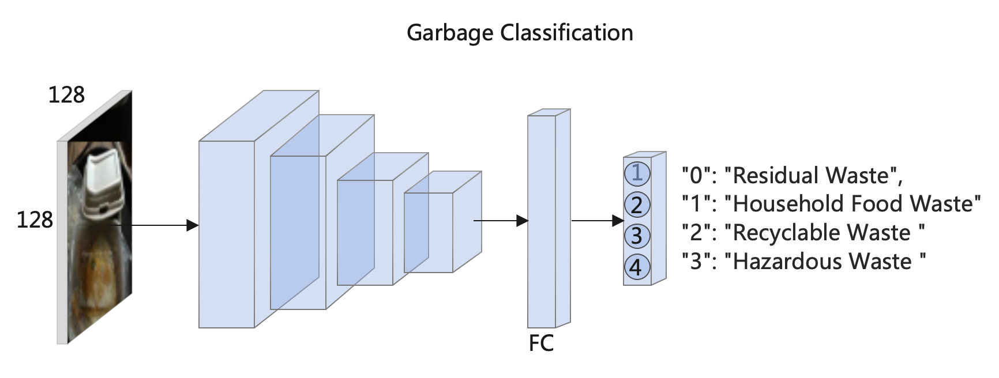
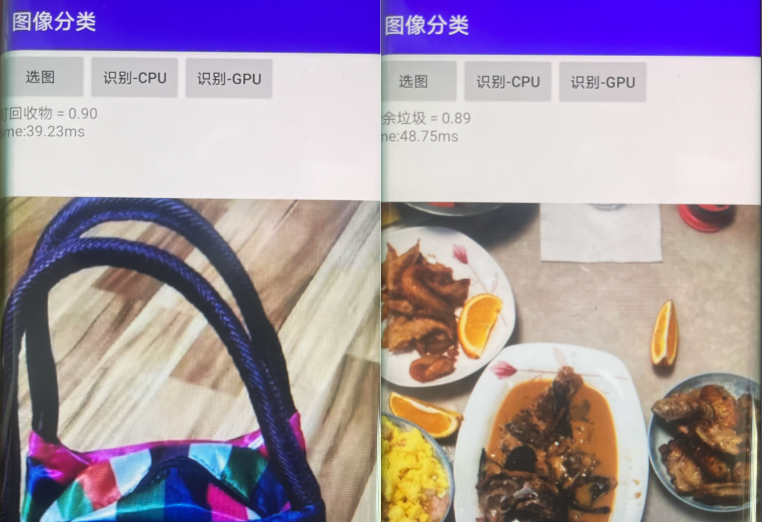

# NanoCls 


- NanoCls is a simple and lightweight image classification model. And it is very suitable for deployment on embedded or mobile devices. We provide [Android demo](./ncnn_android_nanocls) and [MacOS demo](./ncnn_macos_nanocls) based on ncnn inference framework. 



```
Config:mobilenetv2 128x128 width_mult=0.25  batch=128, lr =0.05 
Input Size: torch.Size([1, 3, 128, 128])
MACS： 13.244M  Params: 243.236K
val_accuracy: 0.850 
```

```
Config: shufflenetv2 64x64 width_mult=0.5 batch=128, lr =0.05 
Input Size: torch.Size([1, 3, 128, 128]) 
MACS： 13.555M  Params: 345.892K 
val_accuracy: 0.901 
```
- We provide PyTorch code, and it is very friendly for training with much lower GPU memory cost than other models. We only use grabage classification dataset as tranining dataset.

- We also provide [Pytorch code](https://github.com/HonglinChu/Garbage_Classification) for server deployment

## Data 
[Download](https://pan.baidu.com/s/1a8ToIZqyW9Qo0KeiKaQkLQ) password: u94u
```
cd xxx/xxx/NanoCls
mkdir data
Put your train data into 'data' directory
```
## Train

```
python train.py 
```

## Test

```
python predict.py 
```

## PyTorch to ONNX
```
python pytorch2onnx.py
```
## ONNX to NCNN
```
https://convertmodel.com/
```
# NanoCls for MacOS 

- 1. Modify your own CMakeList.txt

- 2. Build (Apple M1 CPU) 

    ```
    $ sh make_macos_arm64.sh 
    ```

# NanoCls for Android

[Android demo](https://www.bilibili.com/video/bv1t94y1o7qt)

- 1. Modify your own CMakeList.txt

- 2. [Download](https://pan.baidu.com/s/1t3HJz1qulqbeL96kNdMGrw) password: tcmb OpenCV and NCNN libraries for Android 

# Reference 

https://github.com/d-li14/mobilenetv2.pytorch

https://github.com/d-li14/mobilenetv3.pytorch

https://github.com/WZMIAOMIAO/deep-learning-for-image-processing
